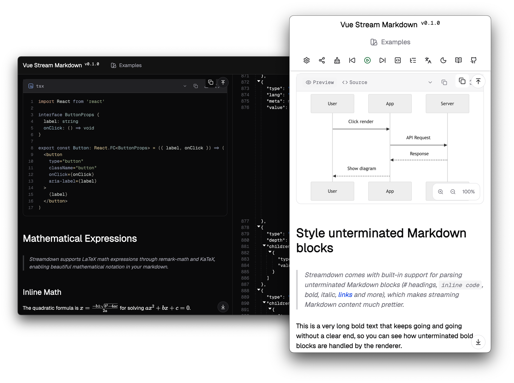

# vue-stream-markdown

[![npm version][npm-version-src]][npm-version-href]
[![License][license-src]][license-href]

A markdown renderer specially optimized for streaming scenarios, inspired by [streamdown](https://streamdown.ai/). Designed to achieve smoother streaming rendering through syntax inference and highly customizable rendering elements.

```sh
pnpm add vue-stream-markdown
```

<br>

<p align="center">
<a href="https://docs-vue-stream-markdown.netlify.app/">📚 Documentation</a> |
<a href="https://play-vue-stream-markdown.netlify.app/">🤹‍♂️ Playground</a>
</p>

<br>

<p align='center'>

</p>

## Features

- **Streaming-optimized rendering** - Incomplete node completion with loading states for images, tables, and code blocks to prevent visual jitter
- **Incremental rendering** - Leverages [Shiki](https://shiki.style/)'s `codeToTokens` API for token-level updates, reducing DOM recreation overhead
- **Progressive Mermaid rendering** - Throttled, streaming-friendly diagram rendering with loading states
- **Streaming LaTeX rendering** - Progressive math equation rendering with KaTeX support
- **Interactive controls** - Copy and download buttons for images, tables, and code blocks
- **Fully customizable** - Replace any AST node with your own Vue components
- **Theme-aware scoped styles** - Scoped styles under `.stream-markdown` with semantic `data-stream-markdown` attributes, following [shadcn/ui](https://ui.shadcn.com/) design system
- **Beautiful built-in typography** - No atomic CSS required (Tailwind/UnoCSS), self-contained styles
- **Content hardening & security** - Built-in protection against malicious Markdown with URL validation and protocol blocking
- **SSR support** - Full server-side rendering compatibility with environment detection utilities

## Usage

> [!IMPORTANT]
> 🚧 **vue-stream-markdown** is currently in active feature development.
> From version `0.4.0` onwards, you need to manually include `katex.min.css`. If CDN is enabled, it will be automatically loaded.

For detailed usage and API documentation, please refer to the [Documentation](https://docs-vue-stream-markdown.netlify.app/).

```vue
<script setup lang="ts">
import { ref } from 'vue'
import { Markdown } from 'vue-stream-markdown'
// If CDN is enabled, you don't need to manually import katex.min.css
import 'katex/dist/katex.min.css'
import 'vue-stream-markdown/index.css'
// If you don't have shadcn CSS variables globally, import the theme
import 'vue-stream-markdown/theme.css'

const content = ref('# Hello World\n\nThis is a markdown content.')
</script>

<template>
  <Markdown :content="content" />
</template>
```

## Credit

This project is inspired by [streamdown](https://streamdown.ai/) and even uses some source code from it.

This project also uses and benefits from:

- [mdast](https://github.com/syntax-tree/mdast) - Markdown Abstract Syntax Tree format
- [Shiki](https://shiki.style/) - Beautiful syntax highlighting
- [Mermaid](https://mermaid.js.org/) - Diagramming and charting tool
- [KaTeX](https://katex.org/) - Fast math typesetting library for the web
- [Remend](https://github.com/vercel/streamdown/tree/main/packages/remend) - This project implements similar functionality inspired by remend for intelligently parsing and completing incomplete Markdown blocks.

### Code Sources
- [markstream-vue](https://github.com/Simon-He95/markstream-vue) - The original inspiration for learning AST-based custom markdown rendering, and the source of the animation implementation used in this project
- [ast-explorer](https://github.com/sxzz/ast-explorer) - Learned AST knowledge from this project, and the playground layout inspiration and AST syntax tree filtering code are derived from it
- [medium-zoom](https://github.com/francoischalifour/medium-zoom) - Inspired the custom image zoom implementation
- [markdown-sanitizers](https://github.com/vercel-labs/markdown-sanitizers) - URL validation and security hardening logic in `src/utils/harden.ts` is ported from `rehype-harden`
- [Dify](https://github.com/langgenius/dify) - LaTeX preprocessing logic in `src/preprocess/vendored/markdown-utils.ts` is ported from Dify

## Acknowledgments

I would like to express my sincere gratitude to those who provided guidance and support during the project selection phase and promotion phase of this project. Without their encouragement and support, I would not have been able to complete this work. In particular, the [streamdown](https://streamdown.ai/) community provided excellent code guidance and even helped fix several issues.

## Troubleshooting

The playground supports generating shareable links and provides streaming controls (forward/backward navigation) for debugging streaming rendering issues.

If you encounter any problems, please:

1. Use the **Generate Share Links** button in the playground to create a shareable link with your current content
2. Enable the **AST Result** toggle to view the parsed AST syntax tree
3. Copy the markdown content and AST syntax tree at the time of the issue

Please provide the shareable link, markdown content, and AST syntax tree when creating an issue. This will help me reproduce and diagnose the problem more effectively.

## Contributors

[](https://github.com/jinghaihan/vue-stream-markdown/graphs/contributors)

## License

[MIT](./LICENSE) License © [jinghaihan](https://github.com/jinghaihan)

<!-- Badges -->

[npm-version-src]: https://img.shields.io/npm/v/vue-stream-markdown?style=flat&colorA=080f12&colorB=1fa669
[npm-version-href]: https://npmjs.com/package/vue-stream-markdown
[npm-downloads-src]: https://img.shields.io/npm/dm/vue-stream-markdown?style=flat&colorA=080f12&colorB=1fa669
[npm-downloads-href]: https://npmjs.com/package/vue-stream-markdown
[bundle-src]: https://img.shields.io/bundlephobia/minzip/vue-stream-markdown?style=flat&colorA=080f12&colorB=1fa669&label=minzip
[bundle-href]: https://bundlephobia.com/result?p=vue-stream-markdown
[license-src]: https://img.shields.io/badge/license-MIT-blue.svg?style=flat&colorA=080f12&colorB=1fa669
[license-href]: https://github.com/jinghaihan/vue-stream-markdown/LICENSE
[jsdocs-src]: https://img.shields.io/badge/jsdocs-reference-080f12?style=flat&colorA=080f12&colorB=1fa669
[jsdocs-href]: https://www.jsdocs.io/package/vue-stream-markdown
