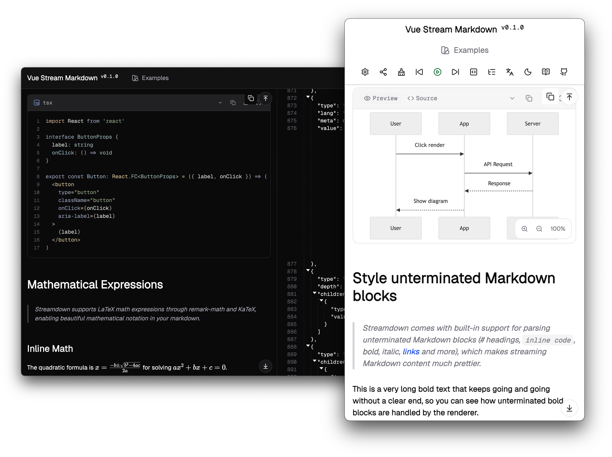

# vue-stream-markdown

[![npm version][npm-version-src]][npm-version-href]
[![npm downloads][npm-downloads-src]][npm-downloads-href]
[![bundle][bundle-src]][bundle-href]
[![License][license-src]][license-href]

A markdown renderer specially optimized for streaming scenarios, inspired by [Streamdown](https://streamdown.ai/). Designed to achieve smoother streaming rendering through syntax inference and highly customizable rendering elements.

<a href="https://docs-vue-stream-markdown.netlify.app/">Documentation</a> |
<a href="https://play-vue-stream-markdown.netlify.app/">Playground</a>

## Features

- **Streaming-optimized rendering** - Incomplete node completion with loading states for images, tables, and code blocks to prevent visual jitter
- **Syntax highlighting** - Highlight code with [Shiki](https://shiki.style/) through the independently installable `@stream-markdown/code` extension
- **Diagram rendering** - Combine [Mermaid](https://mermaid.js.org/) and [Beautiful Mermaid](https://github.com/lukilabs/beautiful-mermaid) renderers with deterministic fallback
- **Mathematical typesetting** - Parse mathematical notation with [Comark](https://github.com/comarkdown/comark) and render it with [KaTeX](https://katex.org/)
- **Native HTML and custom tags** - Render safe HTML and map custom tags directly to Vue components
- **Interactive controls** - Copy and download buttons for images, tables, and code blocks
- **Fully customizable** - Replace any Comark/native tag or UI component with your own Vue components
- **Theme-aware scoped styles** - Scoped styles under `.stream-markdown` with semantic `data-stream-markdown` attributes, following [shadcn/ui](https://ui.shadcn.com/) design system
- **Beautiful built-in typography** - No atomic CSS required ([Tailwind CSS](https://tailwindcss.com/)/[UnoCSS](https://unocss.dev/)), self-contained styles
- **Content hardening & security** - Built-in protection against malicious Markdown with URL validation and protocol blocking
- **SSR support** - Full server-side rendering compatibility with environment detection utilities

## Showcase

I am grateful to the teams and builders who trust this library in their products:

- [AI Elements Vue](https://github.com/vuepont/ai-elements-vue)
- [ElevenLabs UI Vue](https://github.com/vuepont/elevenlabs-ui-vue)

Thank you for your trust and support.

## Credit

This project is inspired by [Streamdown](https://streamdown.ai/) and uses [Comark](https://github.com/comarkdown/comark) as its incremental Markdown parser.

This project also uses and benefits from:

- [Comark](https://github.com/comarkdown/comark) - Compact document model and stateful incremental Markdown parser
- [Shiki](https://shiki.style/) - Beautiful syntax highlighting
- [Mermaid](https://mermaid.js.org/) - Diagramming and charting tool
- [Beautiful Mermaid](https://github.com/lukilabs/beautiful-mermaid) - Beautiful Mermaid diagram renderer with Shiki integration
- [KaTeX](https://katex.org/) - Fast math typesetting library for the web
- [Remend](https://github.com/vercel/streamdown/tree/main/packages/remend) - This project implements similar functionality inspired by Remend for intelligently parsing and completing incomplete Markdown blocks.

### Code Sources

- [Markstream Vue](https://github.com/Simon-He95/markstream-vue) - The original inspiration for custom Markdown rendering
- [AST Explorer](https://github.com/sxzz/ast-explorer) - Playground layout and Comark document inspection inspiration
- [Medium Zoom](https://github.com/francoischalifour/medium-zoom) - Inspired the custom image zoom implementation
- [Markdown Sanitizers](https://github.com/vercel-labs/markdown-sanitizers) - URL validation and security hardening logic in `packages/core/src/utils/harden.ts` is ported from [Rehype Harden](https://github.com/vercel-labs/markdown-sanitizers)
- [Dify](https://github.com/langgenius/dify) - LaTeX normalization logic in `packages/markmend/core/src/completion/vendored/markdown-utils.ts` is ported from Dify

## Acknowledgments

I would like to express my sincere gratitude to those who provided guidance and support during the project selection phase and promotion phase of this project. Without their encouragement and support, I would not have been able to complete this work. In particular, the [Streamdown](https://streamdown.ai/) community provided excellent code guidance and even helped fix several issues.

## Troubleshooting

The playground supports generating shareable links and provides streaming controls (forward/backward navigation) for debugging streaming rendering issues.

If you encounter any problems, please:

1. Use the **Generate Share Links** button in the playground to create a shareable link with your current content
2. Enable the **Document Result** toggle to view the parsed Comark document
3. Copy the Markdown content and Comark document at the time of the issue

Please provide the shareable link, Markdown content, and Comark document when creating an issue. This will help me reproduce and diagnose the problem more effectively.

## Contributors

## License

[MIT](./LICENSE) License © [jinghaihan](https://github.com/jinghaihan)

<!-- Badges -->

[npm-version-src]: https://img.shields.io/npm/v/vue-stream-markdown?style=flat&colorA=080f12&colorB=1fa669
[npm-version-href]: https://npmjs.com/package/vue-stream-markdown
[npm-downloads-src]: https://img.shields.io/npm/dm/vue-stream-markdown?style=flat&colorA=080f12&colorB=1fa669
[npm-downloads-href]: https://npmjs.com/package/vue-stream-markdown
[bundle-src]: https://img.shields.io/bundlephobia/minzip/vue-stream-markdown?style=flat&colorA=080f12&colorB=1fa669&label=minzip
[bundle-href]: https://bundlephobia.com/result?p=vue-stream-markdown
[license-src]: https://img.shields.io/badge/license-MIT-blue.svg?style=flat&colorA=080f12&colorB=1fa669
[license-href]: https://github.com/jinghaihan/vue-stream-markdown/LICENSE
[jsdocs-src]: https://img.shields.io/badge/jsdocs-reference-080f12?style=flat&colorA=080f12&colorB=1fa669
[jsdocs-href]: https://www.jsdocs.io/package/vue-stream-markdown
