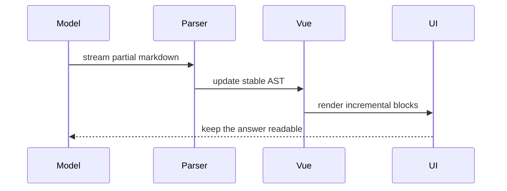

# Streaming markdown for Vue

Vue Stream Markdown is built for answers that arrive piece by piece. It renders useful structure early, keeps the document readable while the text is still incomplete, and lets your Vue app decide how rich the final UI should become.

> The goal is simple: streaming output should feel like a composed document, not a raw terminal log.

## What it handles while text is still arriving

- Headings, paragraphs and lists can appear before the full message is done.
- Links stay safe while their destination is incomplete.
- Code fences keep a readable shell during generation.
- CJK text can use character-level animation while English keeps word-level flow.
- Previewers and custom renderers can turn Markdown nodes into product UI.

## Basic usage

```vue
<script setup lang="ts">
import { ref } from 'vue'
import { Markdown } from 'vue-stream-markdown'
import 'vue-stream-markdown/style.css'

const content = ref('')
</script>

<template>
  <Markdown :content="content" animation-split="auto" />
</template>
```

## GitHub flavored output

- [x] Render task lists
- [x] Support strikethrough and inline code
- [x] Keep partial links inert until complete
- [ ] Let the model finish writing at its own pace

Use **strong text**, _emphasis_, `inline code`, and safe links like [the playground](https://play-vue-stream-markdown.netlify.app/).

## CJK-friendly streaming

中文、English、かな and 한국어 can appear in the same answer. The animation follows the shape of the language, so CJK text feels precise while English still flows by word.

**Important:** streaming content often mixes product copy, code snippets and multilingual notes in the same response.

## Math and diagrams

Inline math such as $$x = \frac{-b \pm \sqrt{b^2 - 4ac}}{2a}$$ can live beside normal prose.

$$
f(x) = \frac{1}{\sigma\sqrt{2\pi}} e^{-\frac{1}{2}\left(\frac{x-\mu}{\sigma}\right)^2}
$$



## Unterminated markdown

Streaming responses often pause in awkward places. The parser tries to keep common unfinished blocks readable:

**A bold phrase can begin before the model has sent its closing marker, and the renderer still keeps the page feeling intentional.**

`Inline code can also continue for a while before the final backtick appears.`

That is the homepage demo: a compact tour of the renderer while the content is still forming.
