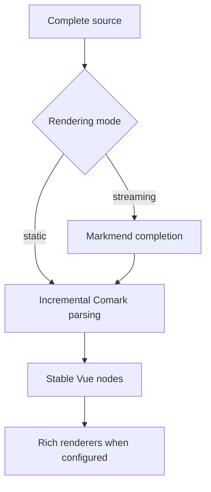

The rendering pipeline is designed around one rule: callers always provide the complete Markdown source they currently have.



## 1. Complete unfinished syntax

When `mode="streaming"`, Markmend repairs supported unfinished syntax in the changing tail. This keeps partial emphasis, links, tables, code fences, and other common structures readable while new text arrives.

When `mode="static"`, completion is skipped and the original source is parsed unchanged.

## 2. Parse incrementally

Each `Markdown` instance keeps a long-lived [Comark](https://github.com/comarkdown/comark) parser. Comark reuses the stable source prefix and parses the changed tail instead of starting from an empty document on every update.

Updates are processed in source order. If one parse fails, the last successfully rendered document remains visible and later updates can still recover.

## 3. Preserve stable Vue output

The compact Comark document is rendered directly to Vue nodes. Completed top-level blocks keep stable identities, so growing content at the end does not replace earlier paragraphs, controls, or interactive components.

Simple semantic elements render synchronously. Stateful features such as code highlighting, math, diagrams, images, tables, and overlays use dedicated Vue components only when the document needs them.

## 4. Add rich output when needed

The main package renders readable code fences without installing large third-party runtimes. Add only the extensions your application uses:

- `@stream-markdown/code` for Shiki
- `@stream-markdown/math` for KaTeX
- `@stream-markdown/mermaid` for the official Mermaid renderer
- `@stream-markdown/beautiful-mermaid` for lightweight diagrams

See [Extensions](/config/extensions) for installation and configuration.

## Custom tags

Native HTML and custom HTML-like tags use the same document representation as Markdown elements. The `components` prop maps a tag directly to a Vue component, without a second HTML parsing layer:

```vue
<script setup lang="ts">
import UserCard from './user-card.vue'

const components = {
  'user-card': UserCard,
}
</script>

<template>
  <Markdown :content="content" :components="components" />
</template>
```
