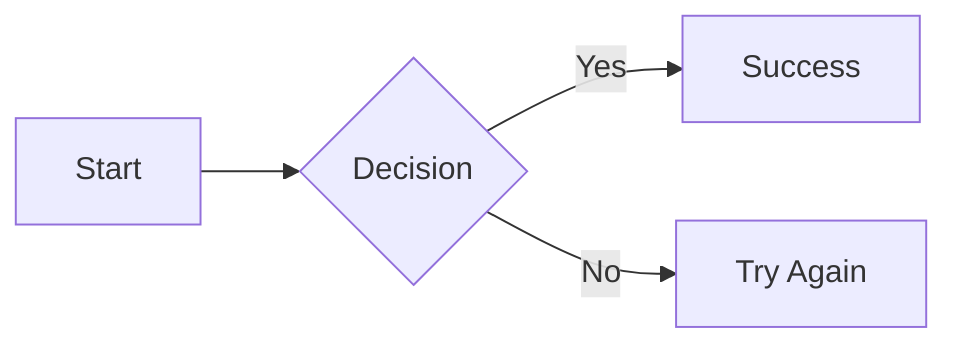

Mermaid fences remain ordinary code blocks until a diagram extension is supplied. This keeps the main package independent of large diagram runtimes.

## Standard Mermaid

Standard Mermaid supports all diagram types provided by the installed Mermaid version:

```sh
pnpm add @stream-markdown/mermaid mermaid
```

```vue
<script setup lang="ts">
import { mermaid } from '@stream-markdown/mermaid'
import { Markdown } from 'vue-stream-markdown'

const extensions = {
  mermaid: mermaid({
    theme: ['neutral', 'dark'],
  }),
}
</script>

<template>
  <Markdown :content="content" :extensions="extensions" />
</template>
```

## Beautiful Mermaid

Beautiful Mermaid provides a smaller renderer with polished built-in themes for its supported diagram types:

```sh
pnpm add @stream-markdown/beautiful-mermaid
```

```ts
import { beautifulMermaid } from '@stream-markdown/beautiful-mermaid'

const extensions = {
  beautifulMermaid: beautifulMermaid({
    theme: ['github-light', 'github-dark'],
    config: { padding: 12 },
  }),
}
```

## Use both with fallback

Both extensions can coexist:

```ts
import { beautifulMermaid } from '@stream-markdown/beautiful-mermaid'
import { mermaid } from '@stream-markdown/mermaid'

const extensions = {
  beautifulMermaid: beautifulMermaid(),
  mermaid: mermaid(),
}
```

The selection order is deterministic:

1. Beautiful Mermaid renders diagram types it supports.
2. Standard Mermaid renders unsupported Beautiful Mermaid diagram types.
3. If no configured extension supports the diagram, the source code block stays visible.

This means installing only Beautiful Mermaid does not implicitly require Mermaid.

## Basic syntax

Create diagrams using a fenced code block with the `mermaid` language:

````markdown

````

::stream-markdown{example="feature-mermaid.basicFlowchart"}
::

## Diagram examples

### Flowchart

::stream-markdown{example="feature-mermaid.flowchart"}
::

### Sequence diagram

::stream-markdown{example="feature-mermaid.sequenceDiagram"}
::

### State diagram

::stream-markdown{example="feature-mermaid.stateDiagram"}
::

### Class diagram

::stream-markdown{example="feature-mermaid.classDiagram"}
::

### Entity relationship diagram

::stream-markdown{example="feature-mermaid.erDiagram"}
::

### Pie and Gantt charts

These examples demonstrate the standard Mermaid fallback when both extensions are enabled:

::stream-markdown{example="feature-mermaid.pieChart"}
::

::stream-markdown{example="feature-mermaid.ganttChart"}
::

## Provider configuration

Configuration is passed directly to the extension factory:

```ts
import type { MermaidExtensionOptions } from '@stream-markdown/mermaid'
import { mermaid } from '@stream-markdown/mermaid'

const options: MermaidExtensionOptions = {
  theme: ['base', 'dark'],
  config: {
    securityLevel: 'strict',
    flowchart: {
      nodeSpacing: 50,
      rankSpacing: 50,
      curve: 'basis',
    },
    sequence: {
      actorMargin: 50,
    },
  },
}

const mermaidExtension = mermaid(options)
```

See [Optional Extensions](/config/external-options) for CDN loading, error components, and all factory options.

## Interactive controls

Rendered diagrams use the normal code-block preview/source switch and support fullscreen, SVG/PNG download, and zoom controls. See [Controls](/config/controls) for customization.

## Streaming behavior

During streaming, incomplete Mermaid fences remain readable and preview rendering is throttled. A diagram becomes previewable only when at least one configured extension reports that it supports the current source.

## Troubleshooting

- Confirm the fence language is `mermaid`.
- Verify the corresponding extension instance is included in `extensions`.
- Install the `mermaid` peer dependency when using `@stream-markdown/mermaid`.
- Test syntax in the [Mermaid Live Editor](https://mermaid.live/).
- Use both diagram extensions when you want Beautiful Mermaid styling plus full syntax coverage.

## Resources

- [Mermaid documentation](https://mermaid.js.org/intro/)
- [Beautiful Mermaid documentation](https://github.com/lukilabs/beautiful-mermaid)
