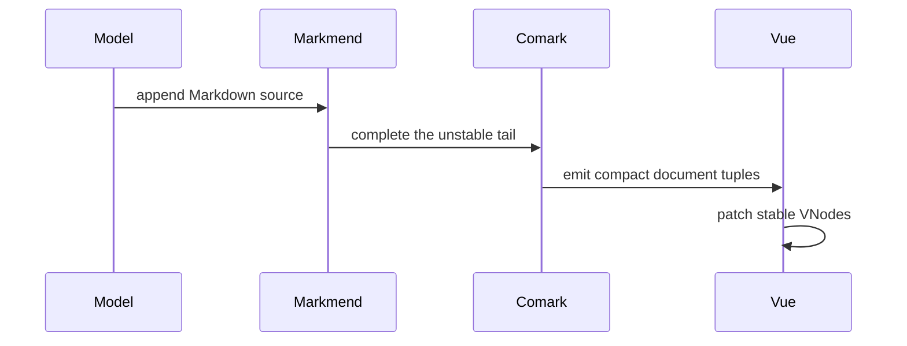

::u-page-hero
#title
Markdown that keeps up with streaming output.

#description
A Vue renderer for partial, changing Markdown with stable incremental parsing, rich previews, and first-class LLM output support.

#links
:::u-button
---

to: /guide
size: lg
trailing-icon: i-lucide-arrow-right
---

Read the docs
:::

:::u-button
---

to: https://play-vue-stream-markdown.netlify.app/
target: _blank
color: neutral
variant: outline
size: lg
trailing-icon: i-lucide-external-link
---

Playground
:::
::

::landing-hero-demo
---

playground: https://play-vue-stream-markdown.netlify.app/
source: |

# Streaming Markdown for Vue

Content can become **structured UI** before the final token arrives.

- Stable incremental parsing
- GFM, CJK, math, Mermaid, and safe links
- Replaceable renderers and controls

```ts
import { Markdown } from 'vue-stream-markdown'
```



---

::

::landing-features
#headline
Built for live output

#title
One renderer from the first token to the settled document

#default
:::landing-feature-card{icon="i-lucide-radio"}
#title
Stream-first completion

#description
Markmend keeps common incomplete Markdown readable without changing settled source semantics.
:::

:::landing-feature-card{icon="i-lucide-gauge"}
#title
Incremental Comark parser

#description
A long-lived parser reuses the stable prefix and emits compact tuples directly to Vue VNodes.
:::

:::landing-feature-card{icon="i-lucide-blocks"}
#title
Product-ready rendering

#description
Code, tables, images, math, Mermaid, CJK animation, security, and custom components share one renderer.
:::
::

::landing-cta
#title
Start rendering streaming Markdown.

#description
Install the component, pass the complete source as it grows, and switch to static mode when the stream settles.

#links
:::u-button{to="/guide/usage" size="lg" trailing-icon="i-lucide-arrow-right"}
Get started
:::
::
