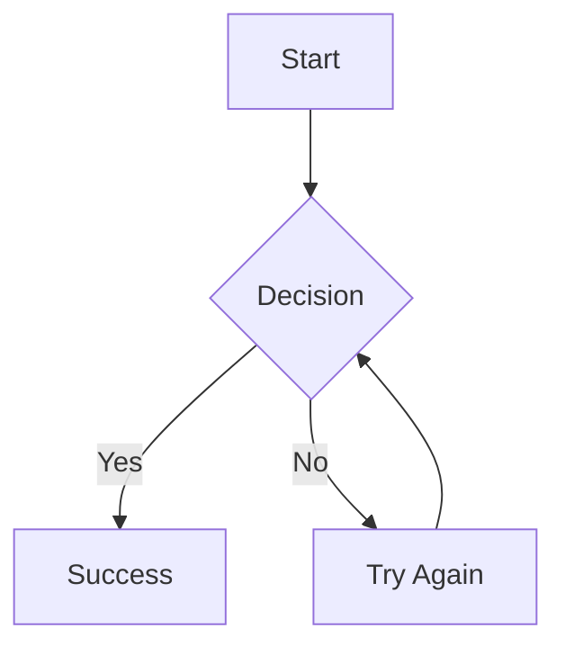

<script setup>
const basicFlowchart = `
\`\`\`mermaid
graph TD
    A[Start] --> B{Decision}
    B -->|Yes| C[Success]
    B -->|No| D[Try Again]
    D --> B
\`\`\`
`

const flowchart = `
\`\`\`mermaid
graph TD
    A[Christmas] -->|Get money| B(Go shopping)
    B --> C{Let me think}
    C -->|One| D[Laptop]
    C -->|Two| E[iPhone]
    C -->|Three| F[Car]
\`\`\`
`

const sequenceDiagram = `
\`\`\`mermaid
sequenceDiagram
    participant User
    participant Browser
    participant Server
    participant Database

    User->>Browser: Enter URL
    Browser->>Server: HTTP Request
    Server->>Database: Query data
    Database-->>Server: Return results
    Server-->>Browser: HTTP Response
    Browser-->>User: Display page
\`\`\`
`

const stateDiagram = `
\`\`\`mermaid
stateDiagram-v2
    [*] --> Idle
    Idle --> Loading: start
    Loading --> Success: data received
    Loading --> Error: failed
    Success --> Idle: reset
    Error --> Loading: retry
    Success --> [*]
\`\`\`
`

const classDiagram = `
\`\`\`mermaid
classDiagram
    class User {
        +String name
        +String email
        +login()
        +logout()
    }
    class Post {
        +String title
        +String content
        +Date createdAt
        +publish()
    }
    User "1" --> "*" Post: creates
\`\`\`
`

const pieChart = `
\`\`\`mermaid
pie title Project Time Distribution
    "Development" : 45
    "Testing" : 20
    "Documentation" : 15
    "Meetings" : 20
\`\`\`
`

const ganttChart = `
\`\`\`mermaid
gantt
    title Project Schedule
    dateFormat YYYY-MM-DD
    section Design
    Wireframes       :2024-01-01, 7d
    Mockups         :2024-01-08, 7d
    section Development
    Frontend        :2024-01-15, 14d
    Backend         :2024-01-15, 14d
    section Testing
    QA Testing      :2024-01-29, 7d
\`\`\`
`

const erDiagram = `
\`\`\`mermaid
erDiagram
    USER ||--o{ POST : creates
    USER {
        int id PK
        string email
        string name
    }
    POST {
        int id PK
        int userId FK
        string title
        text content
    }
    POST ||--o{ COMMENT : has
    COMMENT {
        int id PK
        int postId FK
        string content
    }
\`\`\`
`

const gitGraph = `
\`\`\`mermaid
gitGraph
    commit
    commit
    branch develop
    checkout develop
    commit
    commit
    checkout main
    merge develop
    commit
\`\`\`
`

const styledNode = `
\`\`\`mermaid
graph TD
    A[Node]
    style A fill:#f9f,stroke:#333,stroke-width:4px
\`\`\`
`

const subgraph = `
\`\`\`mermaid
graph TD
    subgraph Group A
        A1 --> A2
    end
    subgraph Group B
        B1 --> B2
    end
    A2 --> B1
\`\`\`
`

</script>

# Mermaid Diagrams

vue-stream-markdown includes built-in support for [Mermaid](https://mermaid.js.org/) diagrams, allowing you to create flowcharts, sequence diagrams, state diagrams, and more using simple text-based syntax. Each diagram includes interactive controls for fullscreen viewing, downloading, and copying.

## Basic Usage

Create Mermaid diagrams using code blocks with the `mermaid` language identifier:

````markdown

````

vue-stream-markdown will render the diagram as an interactive SVG with controls.

<StreamMarkdown :content="basicFlowchart" />

## Diagram Types

### Flowcharts

Create flowcharts to visualize processes and workflows:

<StreamMarkdown :content="flowchart" />

**Node Shapes:**
- `[text]` - Rectangle
- `(text)` - Rounded rectangle
- `{text}` - Rhombus (decision)
- `((text))` - Circle
- `[[text]]` - Subroutine shape

**Direction:**
- `graph TD` - Top to bottom
- `graph LR` - Left to right
- `graph BT` - Bottom to top
- `graph RL` - Right to left

### Sequence Diagrams

Visualize interactions between different actors or systems:

<StreamMarkdown :content="sequenceDiagram" />

**Arrow Types:**
- `->` - Solid line
- `-->` - Dotted line
- `->>` - Solid arrow
- `-->>` - Dotted arrow

### State Diagrams

Model state machines and state transitions:

<StreamMarkdown :content="stateDiagram" />

### Class Diagrams

Document object-oriented designs:

<StreamMarkdown :content="classDiagram" />

### Pie Charts

Display proportional data:

<StreamMarkdown :content="pieChart" />

### Gantt Charts

Plan and track project timelines:

<StreamMarkdown :content="ganttChart" />

### Entity Relationship Diagrams

Model database relationships:

<StreamMarkdown :content="erDiagram" />

### Git Graphs

Visualize Git workflows:

<StreamMarkdown :content="gitGraph" />

## Renderers

::: tip Try it out
Visit the [Playground](https://play-vue-stream-markdown.netlify.app/) to compare vanilla vs beautiful renderer effects.
:::

vue-stream-markdown supports two Mermaid rendering engines:

### Vanilla Renderer (Default)

The standard Mermaid.js renderer that supports all diagram types including flowcharts, sequence diagrams, state diagrams, class diagrams, ER diagrams, pie charts, Gantt charts, git graphs, and more.

### Beautiful Renderer

A beautiful-mermaid integration that creates more aesthetically pleasing diagrams with Shiki theme integration. The beautiful renderer provides:

- Enhanced visual styling with modern design
- Automatic theme synchronization with Shiki syntax highlighting
- Smooth gradients and refined typography
- Support for common diagram types
- **Automatic fallback** to vanilla renderer for unsupported diagram types

**Supported Diagram Types:**

The beautiful renderer currently supports a limited set of diagram types. For the complete and up-to-date list of supported diagrams, please refer to the [beautiful-mermaid documentation](https://github.com/lukilabs/beautiful-mermaid).

## Configuration

### Choosing a Renderer

Select the renderer using the `renderer` property in `mermaidOptions`:

```vue
<script setup lang="ts">
import type { MermaidOptions } from 'vue-stream-markdown'
import { Markdown } from 'vue-stream-markdown'

const mermaidOptions: MermaidOptions = {
  renderer: 'beautiful', // or 'vanilla' (default)
}
</script>

<template>
  <Markdown :mermaid-options="mermaidOptions" />
</template>
```

### Theme Customization

Customize the Mermaid theme using the `mermaidOptions` prop. vue-stream-markdown supports dual themes for light and dark modes.

```vue
<script setup lang="ts">
import type { MermaidOptions } from 'vue-stream-markdown'
import { Markdown } from 'vue-stream-markdown'

const mermaidOptions: MermaidOptions = {
  theme: ['default', 'dark'],
  config: {
    themeVariables: {
      primaryColor: '#ff6b6b',
      primaryTextColor: '#fff',
      primaryBorderColor: '#ff6b6b',
      lineColor: '#f5f5f5',
      secondaryColor: '#4ecdc4',
      tertiaryColor: '#45b7d1'
    }
  }
}
</script>

<template>
  <Markdown :mermaid-options="mermaidOptions" />
</template>
```

The `theme` property accepts an array of two theme names: `[lightTheme, darkTheme]`. vue-stream-markdown will automatically switch between themes based on the current color mode.

### Beautiful Renderer Themes

```vue
<script setup lang="ts">
import type { MermaidOptions } from 'vue-stream-markdown'
import { Markdown } from 'vue-stream-markdown'

const mermaidOptions: MermaidOptions = {
  renderer: 'beautiful',
  beautifulTheme: ['github-light', 'github-dark'],
  beautifulConfig: {
    padding: 12,
  },
}
</script>

<template>
  <Markdown :mermaid-options="mermaidOptions" />
</template>
```

**Theme Fallback:**

If theme not found in `beautiful-mermaid`'s built-ins, falls back to `shiki` themes. This means any `shiki` theme works for diagrams.

### Available Themes

- `default` - Classic Mermaid theme
- `dark` - Dark mode optimized
- `forest` - Green tones
- `neutral` - Minimal styling
- `base` - Clean, modern style

**Example:**

```vue
<script setup lang="ts">
import { Markdown } from 'vue-stream-markdown'

const mermaidOptions = {
  theme: ['base', 'dark']
}
</script>

<template>
  <Markdown :mermaid-options="mermaidOptions" />
</template>
```

### Advanced Configuration

Customize specific diagram types and styling through the `config` property:

```vue
<script setup lang="ts">
import type { MermaidOptions } from 'vue-stream-markdown'
import { Markdown } from 'vue-stream-markdown'

const mermaidOptions: MermaidOptions = {
  theme: ['base', 'dark'],
  config: {
    themeVariables: {
      fontSize: '16px',
      fontFamily: 'Inter, sans-serif',
    },
    flowchart: {
      nodeSpacing: 50,
      rankSpacing: 50,
      curve: 'basis',
    },
    sequence: {
      actorMargin: 50,
      boxMargin: 10,
      boxTextMargin: 5,
    },
  }
}
</script>

<template>
  <Markdown :mermaid-options="mermaidOptions" />
</template>
```

The `config` property accepts a `MermaidConfig` object from the Mermaid library, allowing you to customize all aspects of diagram rendering.

## Interactive Controls

Mermaid diagrams include interactive buttons such as fullscreen, download, and copy. To configure these controls, see the [Controls](/config/controls) documentation.

## Syntax Reference

### Flowchart Links

```
A --> B         // Arrow
A --- B         // Line
A -.-> B        // Dotted arrow
A ==> B         // Thick arrow
A -->|Label| B  // Labeled arrow
```

### Sequence Diagram Actors

```
participant A as Alice
actor B as Bob
```

### Styling Nodes

<StreamMarkdown :content="styledNode" />

### Subgraphs

<StreamMarkdown :content="subgraph" />

## Streaming Considerations

Mermaid diagrams work seamlessly with streaming content:

### Initial Render

When Mermaid diagrams are first streamed in, they appear as code blocks until the diagram syntax is complete. vue-stream-markdown's parser ensures the code block is properly formatted during streaming.

## Common Issues

### Diagram Not Rendering

1. Verify the syntax is correct (check [Mermaid Live Editor](https://mermaid.live/))
2. Ensure the code block uses `` ```mermaid ``
3. Check browser console for JavaScript errors
4. Verify Mermaid is not being blocked by CSP

### Performance with Large Diagrams

Large diagrams may take time to render. Consider:

- Breaking into smaller diagrams
- Simplifying node relationships
- Using subgraphs for organization
- Lazy loading diagram-heavy pages

### Theme Not Applying

1. Verify `mermaidOptions` is properly passed
2. Check that theme names are spelled correctly (for dual themes, use `[lightTheme, darkTheme]`)
3. Ensure custom theme variables are valid

## Resources

- [Mermaid Documentation](https://mermaid.js.org/intro/) - Official docs
- [Mermaid Live Editor](https://mermaid.live/) - Test diagrams online
- [Syntax Reference](https://mermaid.js.org/intro/syntax-reference.html) - Complete syntax guide
- [Mermaid Examples](https://mermaid.js.org/ecosystem/integrations.html) - Gallery of examples
