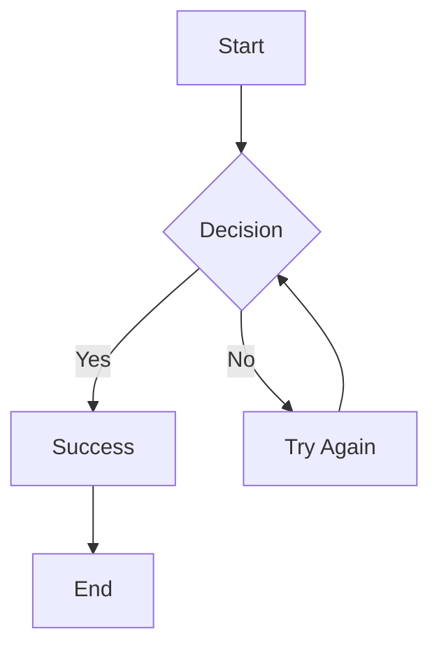
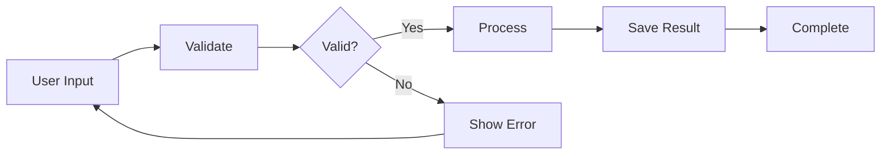
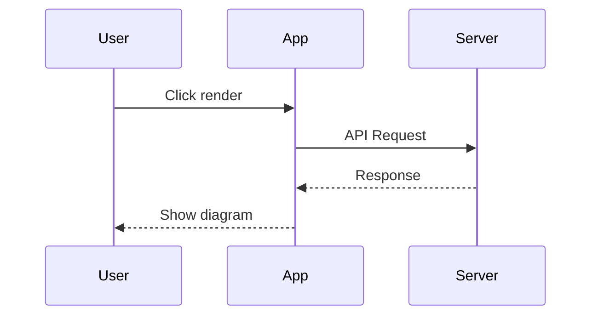

# Built-in typography styles

> Streamdown comes with built-in Tailwind classes for common Markdown components — headings, lists, code blocks, and more.

# AI Models Overview

Modern AI models have revolutionized how we interact with technology. From **language models** to _computer vision_, these systems demonstrate remarkable capabilities.

## Key Features

### Benefits
- Natural language understanding
- Multi-modal processing
- Real-time inference

### Requirements
1. GPU acceleration
2. Model weights
3. API access

## Architecture


## Insights

> "The development of full artificial intelligence could spell the end of the human race." — Stephen Hawking

Learn more about [AI safety](https://example.com) and `transformer` architectures.

# GitHub Flavored Markdown

> Streamdown supports GitHub Flavored Markdown (GFM) out of the box, so you get things like task lists, tables, and more.

GFM extends standard Markdown with powerful features. Here's a comprehensive demo:

## Tables

| Feature | Standard MD | GFM |
|---------|------------|-----|
| Tables | ❌ | ✅ |
| Task Lists | ❌ | ✅ |
| Strikethrough | ❌ | ✅ |

## Task Lists

- [x] Implement authentication
- [x] Add database models
- [ ] Write unit tests
- [ ] Deploy to production

## Strikethrough

~~Old approach~~ → New approach with AI models

# CJK Language Support

> Built-in support for Chinese, Japanese, and Korean languages ensures emphasis markers work correctly with ideographic punctuation—critical for AI-generated content.

Streamdown properly handles emphasis in Chinese, Japanese, and Korean text, even with ideographic punctuation.

## Japanese

Standard markdown breaks with ideographic punctuation:

**この文は太字になります（This sentence will be bolded）。**この文が後に続いても大丈夫です。

*斜体のテキスト【補足情報】。*この文が後に続いても大丈夫です。

~~削除されたテキスト（古い情報）。~~この文は正しいです。

## Chinese

Works seamlessly with Chinese punctuation:

**重要提示（Important Notice）：**请注意。

*这是斜体文字（带括号）。*这句子继续也没问题。

~~旧方法（已废弃）。~~这个句子是正确的。

## Korean

Korean text with mixed punctuation:

**한국어 구문(괄호 포함)**을 강조.

*이 텍스트(괄호 포함)*는 기울임꼴입니다.

~~이 텍스트(괄호 포함)~~를 삭제합니다.

# Beautiful, interactive code blocks

> Streamdown uses [Shiki](https://shiki.style/) to highlight code blocks, and comes with copy and download buttons in the header.

```tsx
import React from 'react'

interface ButtonProps {
  label: string
  onClick: () => void
}

export const Button: React.FC<ButtonProps> = ({ label, onClick }) => (
  <button
    type="button"
    className="button"
    onClick={onClick}
    aria-label={label}
  >
    {label}
  </button>
)
```

# Mathematical Expressions

> Streamdown supports LaTeX math expressions through remark-math and KaTeX, enabling beautiful mathematical notation in your markdown.

## Inline Math

The quadratic formula is $$x = \frac{-b \pm \sqrt{b^2 - 4ac}}{2a}$$ for solving $$ax^2 + bx + c = 0$$.

Euler's identity: $$e^{i\pi} + 1 = 0$$ combines five fundamental mathematical constants.

## Block Math

The normal distribution probability density function:

$$
f(x) = \frac{1}{\sigma\sqrt{2\pi}} e^{-\frac{1}{2}\left(\frac{x-\mu}{\sigma}\right)^2}
$$

## Summations and Integrals

The sum of the first $$n$$ natural numbers: $$\sum_{i=1}^{n} i = \frac{n(n+1)}{2}$$

Integration by parts: $$\int u \, dv = uv - \int v \, du$$

# Interactive Mermaid Diagrams

> Streamdown supports Mermaid diagrams with customizable themes and fullscreen viewing. Theme automatically adapts to light/dark mode.

Interactive diagram rendering with manual control. Use the fullscreen, download, and copy buttons to interact with any Mermaid diagram.

## Simple Flowchart



## Process Flow



## API Sequence



# Style unterminated Markdown blocks

> Streamdown comes with built-in support for parsing unterminated Markdown blocks (# headings, `inline code`, **bold**, _italic_, [links]() and more), which makes streaming Markdown content much prettier.

**This is a very long bold text that keeps going and going without a clear end, so you can see how unterminated bold blocks are handled by the renderer.**

*Here is an equally lengthy italicized sentence that stretches on and on, never quite reaching a conclusion, so you can observe how unterminated italic blocks behave in a streaming Markdown context, particularly when the content is verbose.*

`This is a long inline code block that should be unterminated and continues for quite a while, including some code-like content such as const foo = "bar"; and more, to see how the parser deals with it when the code block is not properly closed`

[This is a very long link text that is unterminated and keeps going to show how unterminated links are rendered in the preview, especially when the link text is verbose and the URL is missing or incomplete](https://www.google.com)
