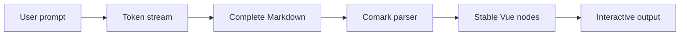
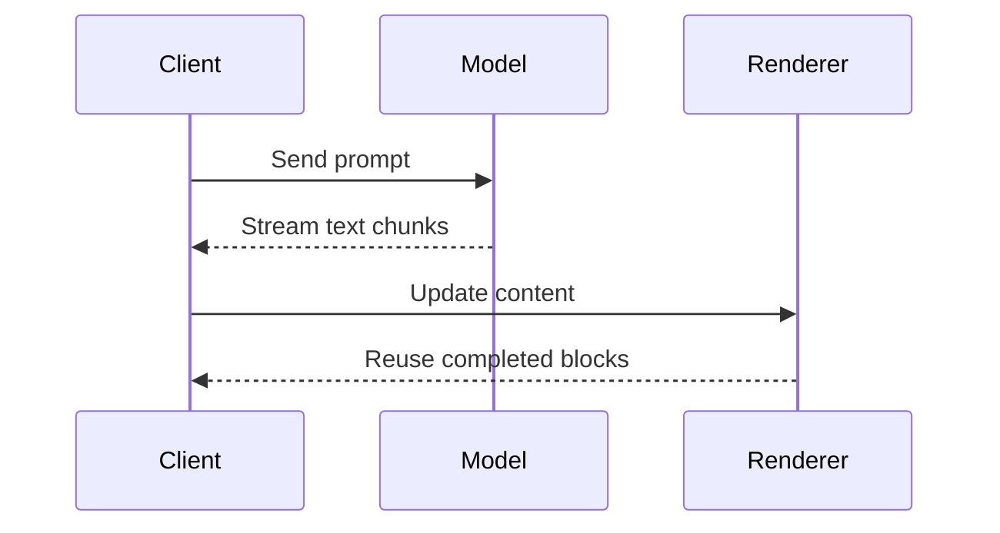

# Feature Showcase

Edit this document, switch between static and streaming modes, or press play to watch a complete Markdown response arrive token by token.

---

## Streaming-ready text

Markdown stays readable while it is still arriving. Paragraphs can mix **bold**, *italic*, ***bold italic***, ~~strikethrough~~, `inline code`, and [safe links](https://github.com/jinghaihan/vue-stream-markdown).

> Incomplete Markdown is repaired while streaming, then parsed as the original source once the response is complete.

### Lists and tasks

- Stable blocks are reused as the tail grows
- Only unfinished content keeps changing
  - text can animate by word or character
  - a caret can mark the active response
- [x] Parse partial Markdown
- [x] Preserve completed blocks
- [ ] Ship the next response

1. Receive a text chunk
2. Complete unfinished syntax
3. Parse and render the document
4. Reuse stable Vue nodes

---

## GitHub Flavored Markdown

Tables, task lists, autolinks, and strikethrough work without additional configuration.

| Capability | Status | Interaction |
| :--- | :---: | ---: |
| Tables | Ready | Copy, download, fullscreen |
| Task lists | Ready | Native checkboxes |
| Autolinks | Ready | Link safety checks |
| Strikethrough | Ready | CJK-friendly |

Visit https://github.com/jinghaihan/vue-stream-markdown or contact hello@example.com.

---

## CJK language support

Formatting remains correct next to Chinese, Japanese, and Korean punctuation.

**重要提示（流式输出）：**中文标点不会破坏强调范围。

*この文章は正しく強調されます（配信中）。*後続の文章も安定します。

~~이전 응답（사용하지 않음）~~은 취소선으로 표시됩니다.

---

## Links and image previews

Images include loading states, downloads, fullscreen previews, zoom controls, and carousel navigation. Open either image and use Previous or Next to switch between them.


---

## Syntax-highlighted code

Inline `const state = ref('streaming')` is rendered immediately. Fenced blocks use the optional Shiki extension and retain their controls while code grows.

```typescript
interface ChatMessage {
  id: string
  role: 'user' | 'assistant'
  content: string
}

async function streamReply(message: ChatMessage) {
  const response = await fetch('/api/chat', {
    method: 'POST',
    body: JSON.stringify(message),
  })

  if (!response.ok)
    throw new Error('Unable to start the stream')

  return response.body
}
```

```vue
<script setup lang="ts">
import { code } from '@stream-markdown/code'
import { Markdown } from 'vue-stream-markdown'

const extensions = [code()]
const content = ref('')
</script>

<template>
  <Markdown
    :content="content"
    :extensions="extensions"
    mode="streaming"
  />
</template>
```

---

## Mathematical expressions

The math extension renders inline expressions such as $$E = mc^2$$ and display equations with KaTeX.

$$
\int_{-\infty}^{\infty} e^{-x^2} \, dx = \sqrt{\pi}
$$

$$
\begin{bmatrix}
a & b \\
c & d
\end{bmatrix}
\begin{bmatrix}
x \\
y
\end{bmatrix}
=
\begin{bmatrix}
ax + by \\
cx + dy
\end{bmatrix}
$$

---

## Mermaid diagrams

Mermaid code can stay as highlighted source, render with Beautiful Mermaid, or fall back to the official Mermaid renderer.





---

## Custom rendering

Safe native HTML can be mixed with Markdown, registered tags can become Vue components, and fenced languages can use custom previewers.

<div class="p-4 mb-4 border border-border rounded-lg">
  <strong>Native HTML</strong> keeps allowed attributes and drops unsafe behavior.
</div>

<GitHub name="vue-stream-markdown" description="A streaming-optimized Markdown renderer for Vue" />

```echarts
{
  "tooltip": {},
  "xAxis": {
    "type": "category",
    "data": ["Parse", "Render", "Update"]
  },
  "yAxis": {
    "type": "value"
  },
  "series": [
    {
      "type": "bar",
      "data": [92, 76, 38],
      "itemStyle": {
        "color": "#4f8cff"
      }
    }
  ]
}
```

---

## Footnotes

Streaming responses can include references without losing their place in the document.[^parser]

Extensions remain opt-in, so applications only install the large renderers they actually use.[^extensions]

[^parser]: Parsing is powered by Comark and adapted for stable Vue rendering.

[^extensions]: Code, math, Mermaid, and Beautiful Mermaid are separate packages.

---

## Blockquotes and nested content

> A response can contain rich nested structures.
>
> 1. Lists remain inside the quote.
> 2. **Formatting** remains available.
>
> > Nested quotes work too.

---

## Streaming completion

The final section is intentionally long enough to make streaming behavior visible. Start playback from the toolbar and watch headings, emphasis, code, links, equations, diagrams, custom renderers, and image controls become usable as soon as enough source has arrived. When playback ends, the renderer switches to the original completed Markdown without replacing stable blocks from earlier in the response.
