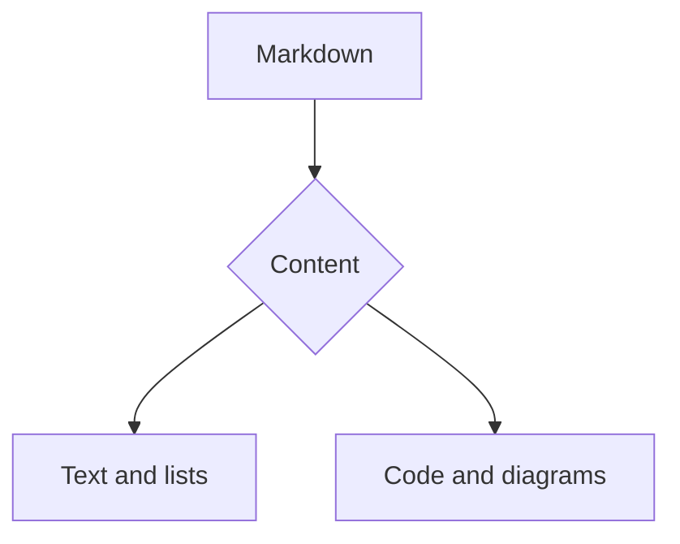
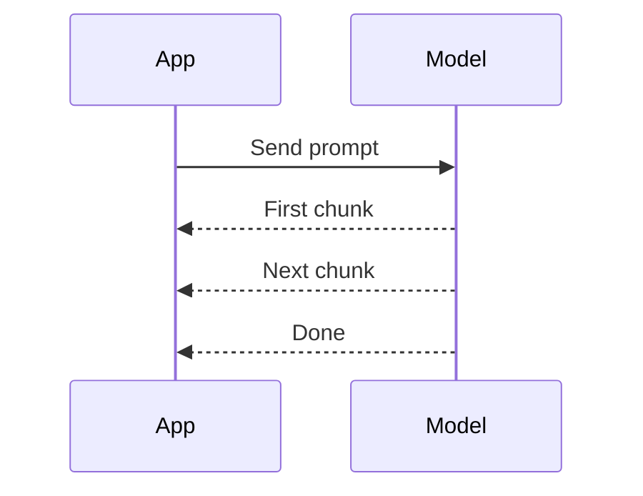
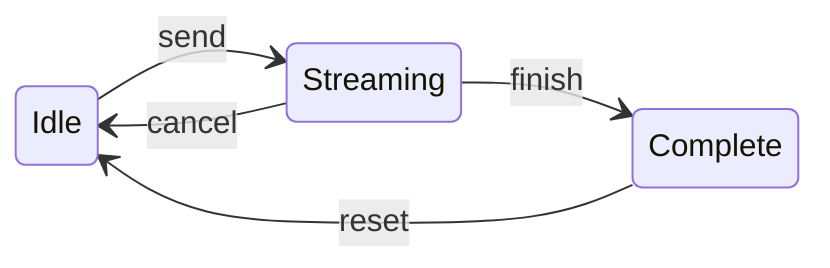
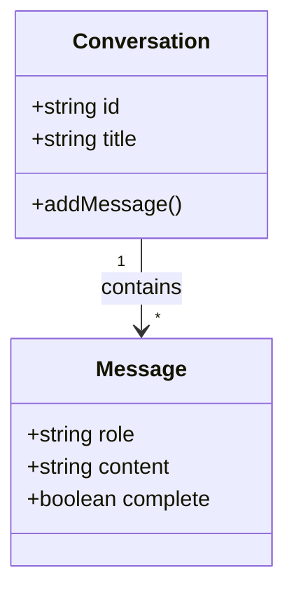

# Vue Stream Markdown

**Markdown for Vue. Built for streaming.**

Turn growing text into readable responses—with syntax completion, animated text, and interactive code, diagrams, and images. Built for AI chat interfaces, with static rendering for finished content too.

An answer rarely arrives as a finished document. A heading comes first, a code fence is still open, and a reference may not have a definition yet. Vue Stream Markdown is designed for that in-between state, as well as the final result.

- **Chat interfaces** — render an assistant's answer as it arrives.
- **Developer tools** — put code, explanations, and diagrams in one response.
- **Research and learning** — combine equations, tables, images, and references.

[Documentation](https://docs-vue-stream-markdown.netlify.app/) · [GitHub](https://github.com/jinghaihan/vue-stream-markdown)

> Press **Play** to watch this page arrive a little at a time. Edit the source on the left, or open **Examples** for a closer look at each feature.

## Start with one component

Pass your accumulated response to `content`. Switch to `static` when the stream finishes.

```vue
<script setup lang="ts">
import { ref } from 'vue'
import { Markdown } from 'vue-stream-markdown'
import 'vue-stream-markdown/index.css'
import 'vue-stream-markdown/theme.css'

const content = ref('Hello, **Vue**!')
const streaming = ref(true)
</script>

<template>
  <Markdown
    :content="content"
    :mode="streaming ? 'streaming' : 'static'"
  />
</template>
```

You provide the text and decide when the stream has ended. The renderer handles Markdown presentation; it does not choose a model or manage your network connection. That keeps the same component useful for a live assistant response, a saved conversation, or a static document.

## Made for the next chunk

Incomplete **emphasis**, `inline code`, and links stay readable as text arrives. Completed blocks are reused while the unfinished tail grows.[^streaming]

- **Keep the response readable**
  - Complete unfinished Markdown during streaming
  - Animate new text by word or character
  - Mark the active response with a caret
- [x] Render the first chunk
- [x] Keep completed blocks stable
- [ ] Write the next idea

### Follow the response as it grows

1. **Receive text.** Append a chunk to the content already received.
2. **Render the unfinished response.** Streaming mode completes supported partial syntax so the reader can follow along.
3. **Finish with the original source.** Static mode skips completion once the answer is ready.

Try pausing playback halfway through a list or code block. Step forward to inspect the next addition, then resume to see the rest of the response.

> **A note for the reader**
>
> A useful answer has structure even before it is finished:
>
> - Start with a short explanation.
> - Add supporting examples.
> - Leave the reader with a clear next step.
>
> > Quotes, nested lists, and emphasis can all live inside the same response.

## More than plain text

GitHub Flavored Markdown brings tables, task lists, and ~~outdated ideas~~ into the same response.

| Content | What you can do |
| :--- | :--- |
| Code | Highlight syntax, copy, and download |
| Tables | Copy, download, and open fullscreen |
| Images | Preview, zoom, and download |
| Links | Review the destination before opening |

Tables can carry actual working content, too. Here is a small example release checklist—not performance data:

| Area | Example to review | Progress |
| :--- | :--- | :---: |
| Streaming | A paragraph followed by a nested list | Done |
| Code | A fenced block with a language label | Done |
| Media | Two images in the same response | Ready to try |
| References | Definitions arriving after the body | Ready to try |

Open either table's toolbar to try copying, downloading, or viewing it fullscreen. Inline formatting such as **priority**, `status`, and ~~superseded text~~ remains available in ordinary Markdown.

### Choose your extensions

Shiki, KaTeX, and diagram renderers are **opt-in extensions**. This playground has them enabled; your app can choose only what it needs.[^extensions]

| Extension | Adds |
| :--- | :--- |
| `@stream-markdown/code` | Shiki syntax highlighting |
| `@stream-markdown/math` | KaTeX mathematical typesetting |
| `@stream-markdown/beautiful-mermaid` | Beautiful Mermaid diagram rendering |
| `@stream-markdown/mermaid` | Official Mermaid rendering and fallback |

Without a matching rich-renderer extension, code fences remain readable as source. Start with text, then add the renderers your interface needs.

### Code worth sharing

The Vue example above shows the component. Add this function to that component's script to consume an async iterable of text chunks:

```typescript
async function readReply(chunks: AsyncIterable<string>) {
  for await (const chunk of chunks)
    content.value += chunk

  streaming.value = false
}
```

Or keep structured output readable with highlighted JSON:

```json
{
  "mode": "streaming",
  "features": ["code", "math", "diagrams"],
  "ready": true
}
```

Use the code toolbar to copy a snippet, download it, or open it fullscreen. Language labels make it easy to tell a component from a data payload at a glance.

**Python · prepare a small response summary**

```python
messages = [
    {"role": "user", "content": "Explain streaming Markdown."},
    {"role": "assistant", "content": "Start with a text chunk."},
]

for index, message in enumerate(messages, start=1):
    words = len(message["content"].split())
    print(f"{index}. {message['role']}: {words} words")
```

**SQL · retrieve a saved conversation**

```sql
SELECT role, content, created_at
FROM messages
WHERE conversation_id = :conversation_id
ORDER BY created_at ASC, id ASC;
```

**CSS · give a response room to breathe**

```css
.chat-response {
  max-width: 72ch;
  margin-inline: auto;
  padding: 1.5rem;
  line-height: 1.7;
}

@media (max-width: 640px) {
  .chat-response {
    padding: 1rem;
  }
}
```

### Every language belongs

Responses can switch languages without switching components. Emphasis should remain useful around CJK punctuation, not just between English words.

**中文（流式输出）：**让内容一点点呈现。

*日本語（ストリーミング）：*少しずつ、読みやすく。

**한국어（스트리밍）：**한 글자씩 자연스럽게.

Mixed-language notes can include **重要提示（Important）：** keep your API key on the server, use `content` for the response text, and mark ~~旧方案（old approach）~~ when an explanation changes.

### A little math

Use inline notation such as $$E = mc^2$$, or give an equation its own space:

$$
P(y \mid x) = \prod_{t=1}^{T} P(y_t \mid x, y_{<t})
$$

In this expression, each next token is conditioned on the input and the tokens that came before it. A response can explain the notation in prose and keep the equation nearby.

For a linear algebra explanation, show the transformation directly:

$$
\begin{bmatrix} a & b \\ c & d \end{bmatrix}
\begin{bmatrix} x \\ y \end{bmatrix}
= \begin{bmatrix} ax + by \\ cx + dy \end{bmatrix}
$$

For a worked example, align the steps so the reader can follow the expansion:

$$
\begin{aligned}
(a+b)^2 &= (a+b)(a+b) \\
        &= a^2 + 2ab + b^2
\end{aligned}
$$

### Diagrams that tell a story

Mermaid turns a fenced code block into a diagram. Try the source toggle or zoom controls.

This small branching flowchart groups the content a response can contain:



A sequence diagram answers a different question: who sends what, and in which order? Here the app receives several chunks before the model signals completion.



**State diagram · the response lifecycle**



**Class diagram · a conversation and its messages**



These diagrams keep their labels short and their layouts compact so they fit beside the Markdown editor. Open **Mermaid Diagrams** in the examples menu for more diagram types.

### Images you can explore

Open either image, then use **Previous** and **Next** to switch between them. Zoom and download controls are available in the preview too.


These two contrasting palettes make the carousel easy to try: open the dark image, move to the light image, then return without closing the preview. Captions help identify each image in the document.

## Make it your own

Map tags to Vue components, add a previewer for a fenced language, or replace built-in controls. The card below is a registered `<GitHub>` component—not an image.

<GitHub name="vue-stream-markdown" description="Streaming Markdown, native Vue components, your interface." />

Native HTML can add small details too: <mark>highlight a takeaway</mark>, write H<sub>2</sub>O, or mark a keyboard shortcut with <kbd>Enter</kbd>.

### Give a code fence its own preview

The Playground registers an ECharts previewer for the `echarts` language. This chart uses illustrative content counts, not library benchmarks. Hover over a slice or switch to **Source** to inspect the data.

```echarts
{
  "tooltip": { "trigger": "item" },
  "legend": { "bottom": 0 },
  "series": [
    {
      "name": "Example content mix",
      "type": "pie",
      "radius": ["35%", "60%"],
      "data": [
        { "name": "Text", "value": 6 },
        { "name": "Code", "value": 3 },
        { "name": "Diagrams", "value": 2 }
      ]
    }
  ]
}
```

The same approach can put your own domain-specific preview beside its source. Use **Custom Rendering** in the examples menu to explore component mapping and custom code previewers separately.

### Fit your interface

- **Style the response.** Use the supplied theme or adapt its theme variables to your app.
- **Replace a renderer.** Map a Markdown or native tag to your own Vue component.
- **Customize the controls.** Bring your own buttons, icons, and other UI components.

The library's styles are scoped under `.stream-markdown`, so a response can have its own typography without requiring Tailwind CSS or UnoCSS in the host app.

## Keep references with the answer

Footnotes let the main explanation stay focused while details live at the end. The streaming note earlier in this page points to how unfinished syntax is handled.[^streaming] The extension note explains how optional renderers fit into the package structure.[^extensions]

During playback, watch the definitions grow as their source arrives. Once a reference is available, click its number to jump to the note and use the return control to get back to the text.

## Take it for a spin

1. **Replay the page** to see paragraphs, lists, and code arrive over time.
2. **Pause and step** through a part you want to inspect more closely.
3. **Try the controls** on a table, diagram, code block, or image.
4. **Make an edit** in the source pane and compare the result.
5. **Open a focused example** when you want more of one feature.

When something looks unexpected, the Playground's document view and share-link control help you capture the content for a reproducible example.

---

**Your content, your pace.** Replay this page, change a line, and see how it renders.

[^streaming]: During streaming, Markmend completes supported unfinished syntax. Static mode parses the original source without completion.

[^extensions]: Code highlighting, math, Mermaid, and Beautiful Mermaid are separate packages. ECharts in this page is a custom Playground integration, not a built-in renderer.
