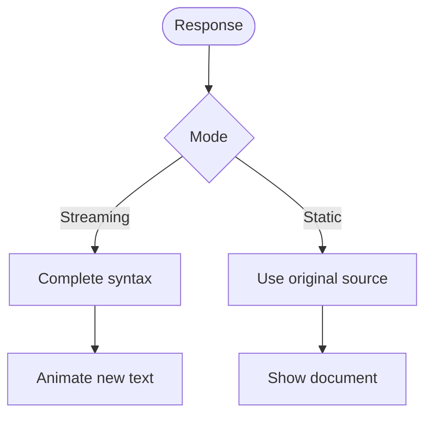
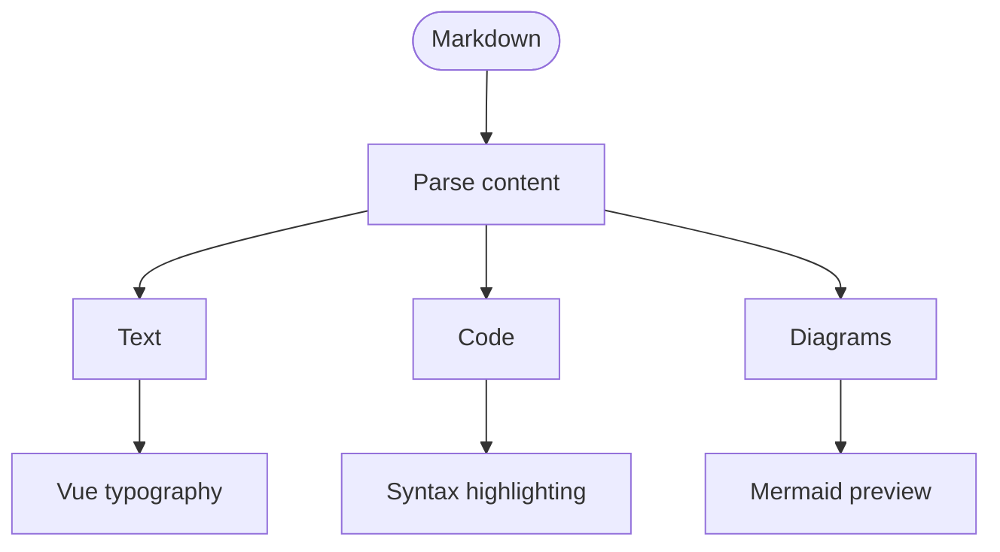
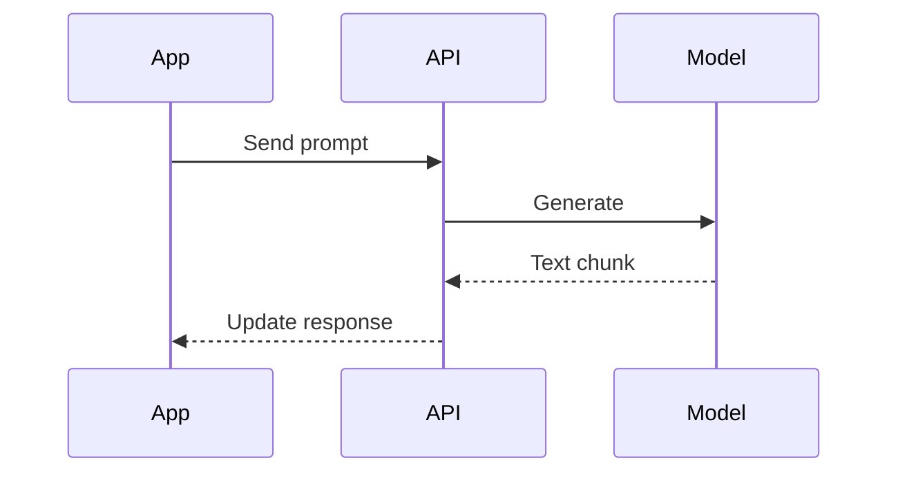
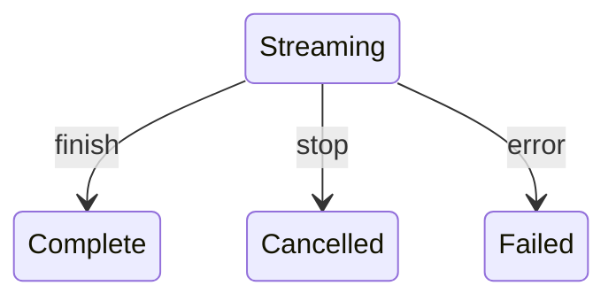
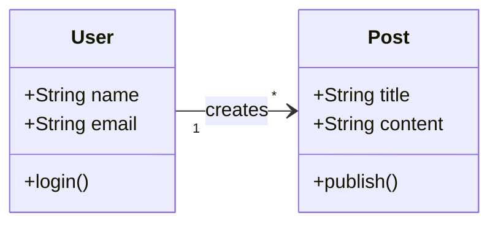
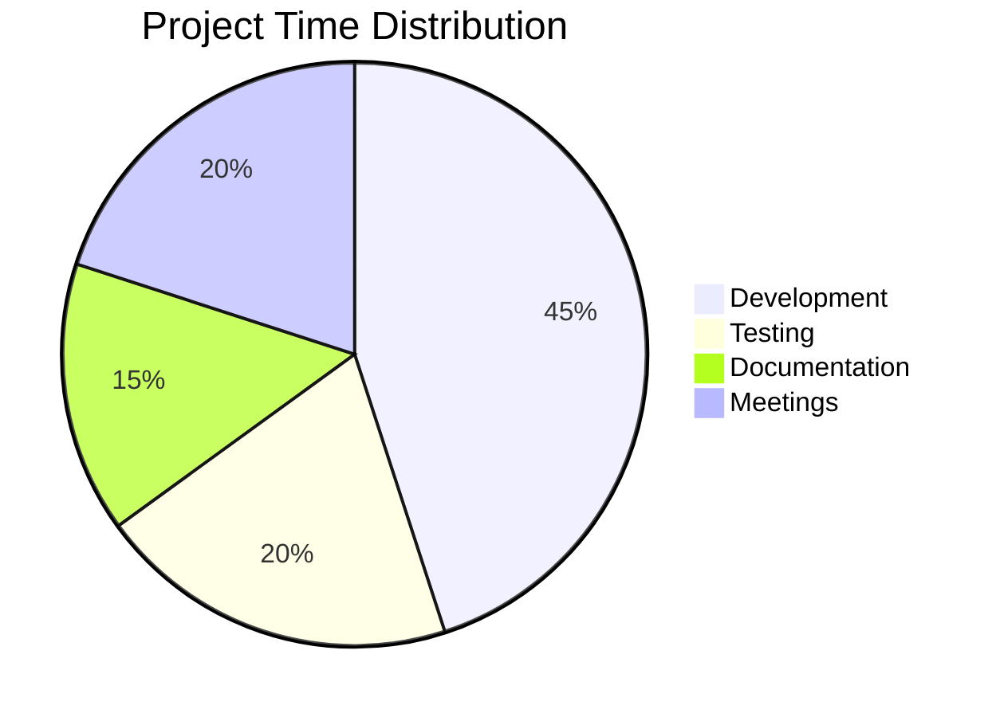
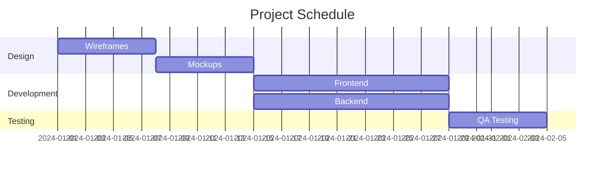
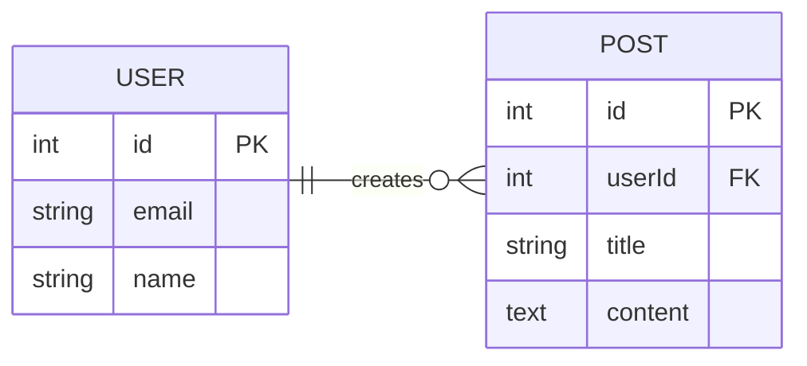
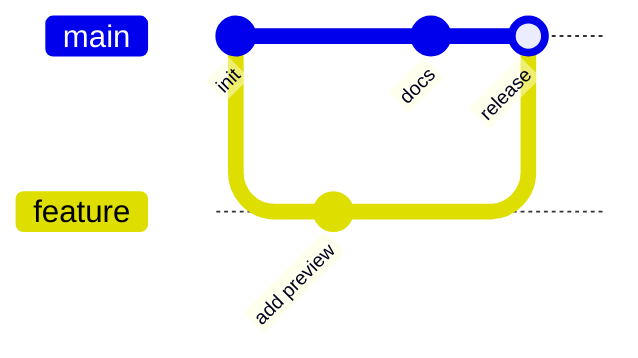
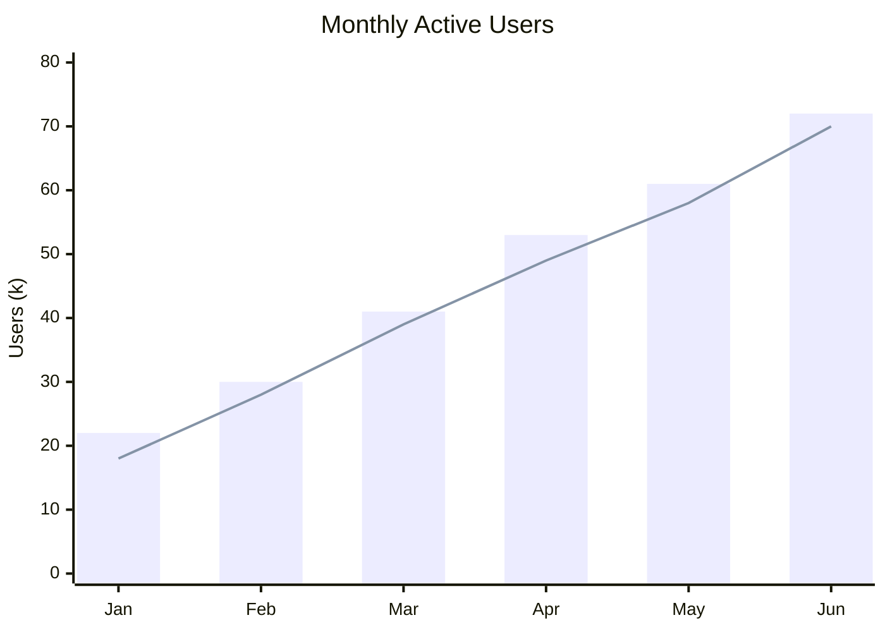

# Mermaid Diagrams

> Create interactive flowcharts, sequence diagrams, and more with Mermaid support.

## Basic Usage

Use a `mermaid` code block to turn a small decision into a diagram. Switch between **Preview** and **Source** to see how it is written.

## Diagram Types

### Flowcharts

Follow Markdown from one source into different kinds of rendered content:

**Node Shapes:**

- `[text]` - Rectangle
- `(text)` - Rounded rectangle
- `{text}` - Rhombus (decision)
- `((text))` - Circle
- `[[text]]` - Subroutine shape

**Direction:**

- `graph TD` - Top to bottom
- `graph LR` - Left to right
- `graph BT` - Bottom to top
- `graph RL` - Right to left

### Sequence Diagrams

Show a short exchange between an app, an API, and a model:

**Arrow Types:**

- `->` - Solid line
- `-->` - Dotted line
- `->>` - Solid arrow
- `-->>` - Dotted arrow

### State Diagrams

Show the possible outcomes of an active response:

### Class Diagrams

Document object-oriented designs:

### Pie Charts

Display proportional data:

### Gantt Charts

Plan and track project timelines:

### Entity Relationship Diagrams

Model database relationships:

### Git Graphs

Visualize Git workflows:

### XY Data Charts

Render bar, line, and combined XY charts:

