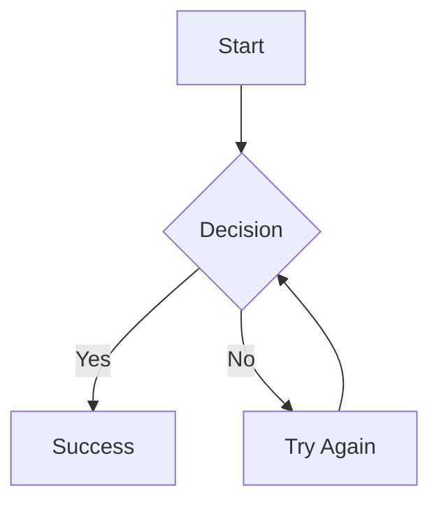
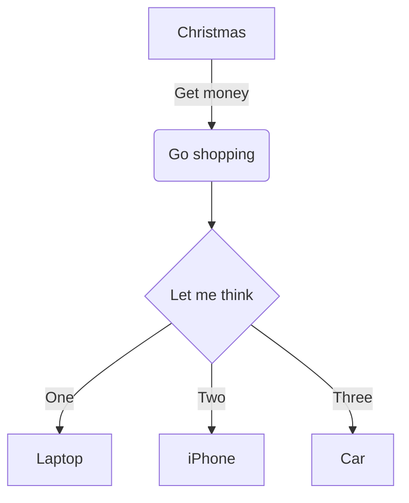
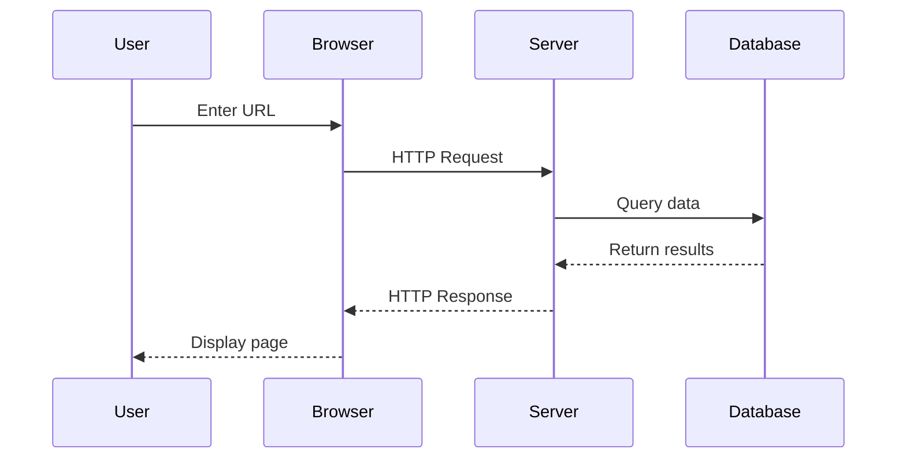
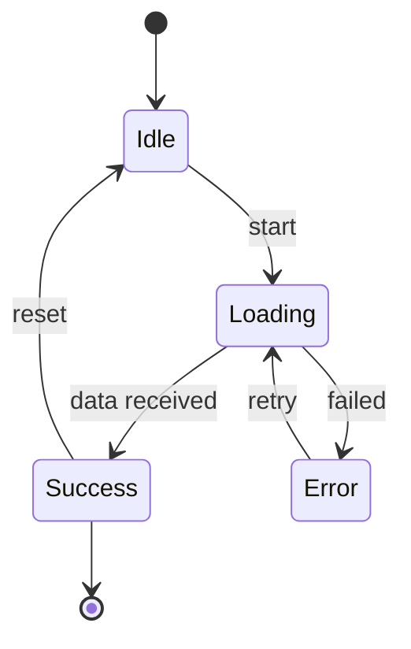
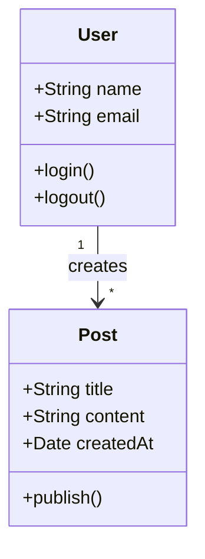
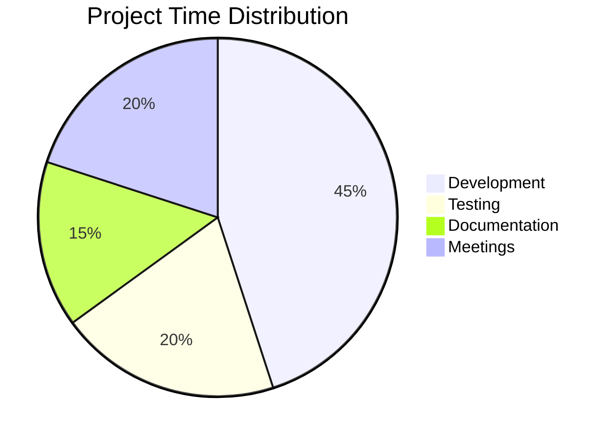
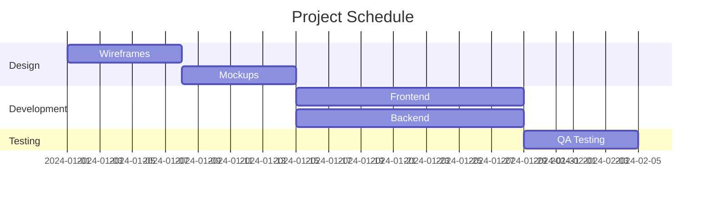
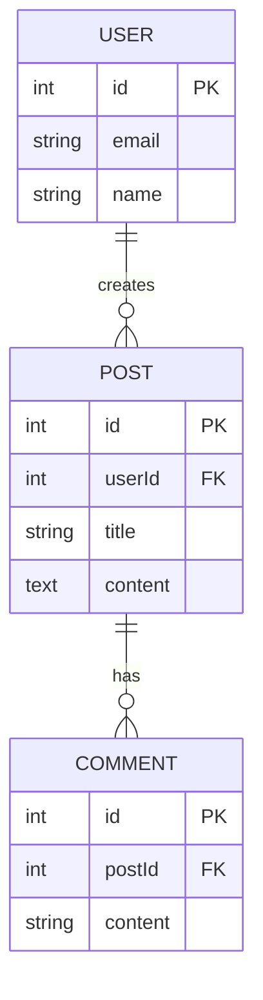
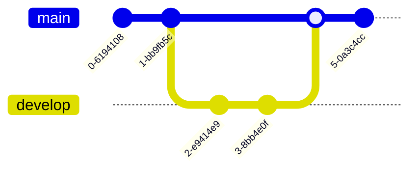

# Mermaid Diagrams

> Create interactive flowcharts, sequence diagrams, and more with Mermaid support.

## Basic Usage

Create Mermaid diagrams using code blocks with the `mermaid` language identifier:

## Diagram Types

### Flowcharts

Create flowcharts to visualize processes and workflows:

**Node Shapes:**
- `[text]` - Rectangle
- `(text)` - Rounded rectangle
- `{text}` - Rhombus (decision)
- `((text))` - Circle
- `[[text]]` - Subroutine shape

**Direction:**
- `graph TD` - Top to bottom
- `graph LR` - Left to right
- `graph BT` - Bottom to top
- `graph RL` - Right to left

### Sequence Diagrams

Visualize interactions between different actors or systems:

**Arrow Types:**
- `->` - Solid line
- `-->` - Dotted line
- `->>` - Solid arrow
- `-->>` - Dotted arrow

### State Diagrams

Model state machines and state transitions:

### Class Diagrams

Document object-oriented designs:

### Pie Charts

Display proportional data:

### Gantt Charts

Plan and track project timelines:

### Entity Relationship Diagrams

Model database relationships:

### Git Graphs

Visualize Git workflows:

